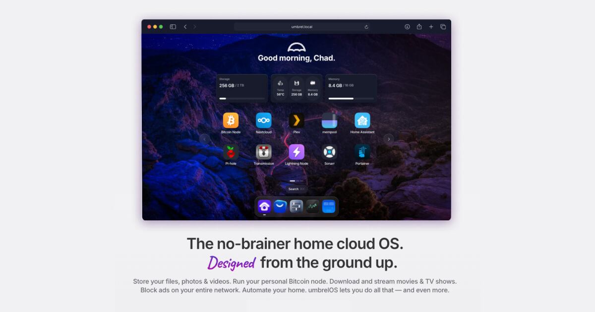
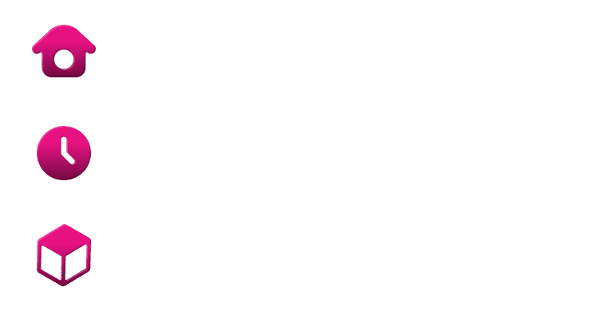
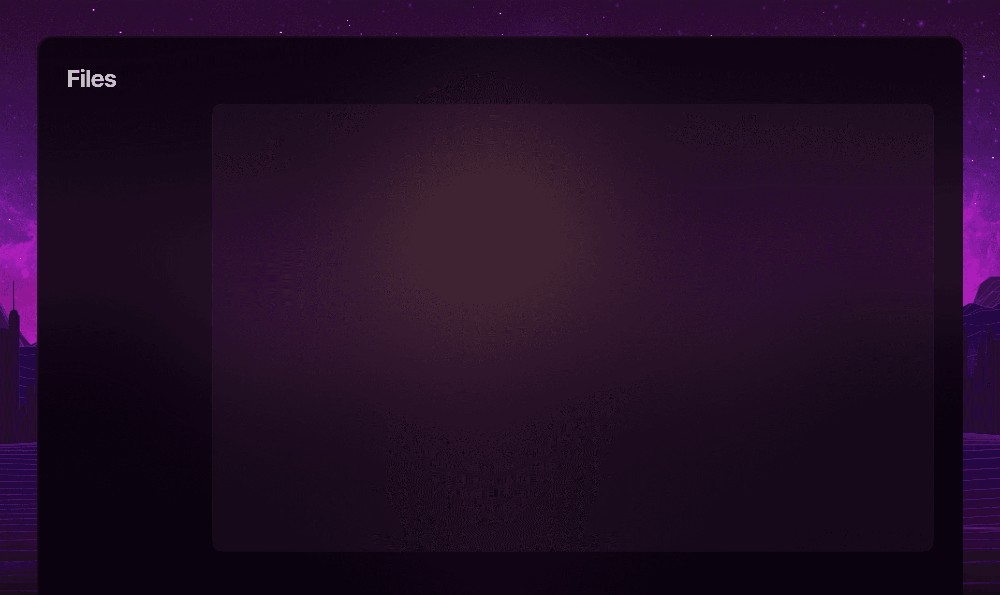

<p align="center">
  <a href="https://github.com/ismailhkn55/NumbrelOs">
    
  </a>
  <h1 align="center">NumbrelOs</h1>
  <p align="center">
    NumbrelOs, Umbrel’in sade ana sayfa stilini Numbrel olarak sunan, CasaOS YAML kurulumunu ve ZimaOS ağ kontrolünü birleştiren ev sunucusu prototipidir.
    <br />
    <br />
    Ubuntu Server, Docker ve Node.js üzerinde çalışacak şekilde tasarlanmıştır.
    <br />
    <br />
    <a href="https://github.com/ismailhkn55/NumbrelOs"><strong>github.com/ismailhkn55/NumbrelOs »</strong></a>
  </p>
</p>

<br />
<br />

<p align="center">
NumbrelOs kullanıcıların verilerini kendilerinin kontrol edebildiği, Umbrel tarzı bir dashboard ile CasaOS/YAML ve ZimaOS ağ yönetimini bir arada sunmayı amaçlar.</p>

<p align="center">

</p>

<br />

## Installing NumbrelOs
> NumbrelOs hâlâ bir prototiptir ve üretim öncesi güvenlik kontrolleri gerektirir. Daha fazla bilgi için `SECURITY.md` dosyasına bakın.

Bu depoyu çalıştırmak için en kolay yol:

```bash
cd /workspaces/NumbrelOs
npm install
npm start
```

Sonra tarayıcıda `http://localhost:3000` adresini açın.

Alternatif olarak Docker ile:

```bash
docker compose up --build
```

<p align="center">

</p>

## Numbrel App Store

NumbrelOs, Umbrel tarzı bir uygulama mağazası deneyimi için bir başlangıç sunar. Aşağıdaki kategoriler ve uygulamalar konsept olarak desteklenebilir:

#### Bitcoin & Finans
- Bitcoin Node — Kendi Bitcoin düğümünü çalıştır
- Electrs — Basit bir Electrum sunucusu
- Mempool — Bitcoin topluluğu için explorer
- BTCPay Server — Ücretsiz Bitcoin ödemeleri kabul et
- Lightning Node — Kendi Lightning ağ düğümünü çalıştır

#### Dosya & Üretkenlik
- Nextcloud — Kontrol sizde olan bir üretkenlik platformu
- PhotoPrism — Fotoğraf ve video kütüphanesi yönetimi
- SyncThing — Cihazlar arası eşitleme
- Vaultwarden — Bitwarden uyumlu güvenli parola yönetimi

#### Medya
- Jellyfin — Ücretsiz medya sistemi
- Radarr — Film koleksiyonu yöneticisi
- Sonarr — TV serisi yöneticisi
- Plex — Medya yayın konsepti

#### Ağ
- Pi-hole — Ağ düzeyinde reklam engelleme
- Tailscale — Uzak erişim için VPN çözümü
- Uptime Kuma — Çevrimdışı izleme
- Transmission — Torrent istemcisi

#### Sosyal
- Element — Matrix istemcisi
- Invidious — İzleme reklamlarını engelleyen YouTube arayüzü
- LibReddit — Özel Reddit ön yüzü
- Nitter — Twitter için reklam ve izleme olmadan arayüz

#### Otomasyon
- Home Assistant — Yerel otomasyon platformu
- n8n — Akış ve otomasyon düzenleme
- Node-RED — IoT ve servis entegrasyonu

#### Geliştirici Araçları
- Code Server — Tarayıcıda VS Code deneyimi
- Gitea — Basit self-hosted Git servisi

<p align="center">

</p>

> Bu liste tamamen konsept içindir. Gerçek uygulama desteği için backend ve Docker yapılandırmaları eklenmelidir.

<p align="center">

</p>

## Building apps for NumbrelOs

Bir uygulama geliştirmek veya mevcut bir servisi paketlemek için `config/sample.yml` içindeki örneği kullanabilir ve `app.js`/`server.js` üzerinde destek ekleyebilirsiniz.

## Contributing

NumbrelOs için katkılarınızı bekliyoruz. Özellikle aşağıdaki konularda yardım edin:

- Umbrel benzeri dashboard tasarımı
- CasaOS YAML desteğini geliştirme
- ZimaOS ağ kontrol panelini genişletme
- Ubuntu Server / Docker dağıtım akışını iyileştirme
- güvenlik ve kimlik doğrulama ekleme

## Security

Bu proje bir prototiptir. Güvenlik açıkları olabilir. Üretim için kullanmadan önce lütfen `SECURITY.md` dosyasını inceleyin.

## License

Bu depo, NumbrelOs prototipi olarak sunulur. Kendi projeleriniz için kaynak olarak kullanabilirsiniz.
